# 🏢 Bài tập lớn Quản Lý Nhà Trọ Adou

> **Học phần:** Phát tiển ứng dụng web 2  
> **Sinh viên thực hiện:** Nguyễn Huỳnh Tường  65134116
> **Công nghệ nền tảng:** Spring Boot Mvc + Thymeleaf + MySQL

---

## 🧭 Tổng Quan Giải Pháp

Hệ thống **Quản lý phòng trọ** được xây dựng nhằm giải quyết bài toán thủ công trong vận hành nhà trọ truyền thống. Bằng cách số hóa toàn bộ dữ liệu, ứng dụng giúp tối ưu hóa quy trình tương tác hai chiều giữa **Chủ trọ (Admin)** và **Khách thuê (User)**, giảm thiểu sai sót khi tính toán hóa đơn và minh bạch hóa chi phí lưu trú.

### Kỹ Thuật Nổi Bật Trong Dự Án
* **Spring Architecture:** Tổ chức mã nguồn phân tầng rõ ràng (Controller -> Service -> Repository -> Model Entities).
* **Data Integrity Protection:** Triển khai các hàm dọn dẹp liên kết khóa ngoại chạy ngầm (`foreign key constraints`) trong Spring Data JPA, ngăn chặn triệt để lỗi sập luồng (Error 500) khi xóa các thực thể phòng trọ hoặc tài khoản.
* **Security & Authentication:** Trích xuất thông tin trực tiếp từ kiến trúc Session của hệ thống để phân định không gian làm việc độc lập cho từng nhóm quyền `ROLE_ADMIN` và `ROLE_USER`.

---

## 🛠️ Bản Đồ Chức Năng Hệ Thống (System Capabilities)

### 🟢 Phân Hệ Khách Thuê (USER Workspace)
- **Khám phá & Đăng ký lưu trú:** Tra cứu hệ thống phòng trống theo thời gian thực và gửi phiếu yêu cầu thuê phòng trực tuyến lên hàng đợi của Admin.
- **Quản lý chi phí hằng tháng:** Tiếp nhận hóa đơn tính tiền, xem giá cả.
- **Tương tác nội bộ:** Gửi tin nhắn trực tiếp để giải đáp thắc mắc về trung tâm xử lý của chủ trọ.
- **Bảo mật hồ sơ:** Quản lý và cập nhật thông tin định danh cá nhân, ảnh chụp căn cước công dân (CCCD) để đăng ký tạm trú.

### 🔵 Phân Hệ Quản Trị Viên (ADMIN Workspace)
- **Quản lý hạ tầng:** Tạo lập, điều chỉnh thông số diện tích, đơn giá phòng và dọn dẹp các phòng trọ không còn người thuê.
- **Kiểm duyệt vận hành:** Xét duyệt danh sách khách đăng ký thuê phòng, tự động gán mã phòng và cập nhật trạng thái phòng thành công.
- **Kế toán tự động:** Nhập chỉ số tiêu thụ điện nước mới, hệ thống tự trích xuất đơn giá cố định và tự động nhân chia cộng gộp ra tổng tiền hóa đơn.
- **Giám sát an ninh:** Quản lý thông tin hồ sơ của khách, thực thi lệnh khóa/mở khóa quyền truy cập hệ thống của khách thuê, xoá tài khoản khách thuê.

---

## 📸 Giao diện hệ thống

---

### 🌐 PHẦN I: PHÂN HỆ XÁC THỰC & CHỨC NĂNG CHUNG

#### 🔹 Hình 5.1: Giao diện trang chủ hệ thống dành cho khách vãng lai (Chưa đăng nhập)
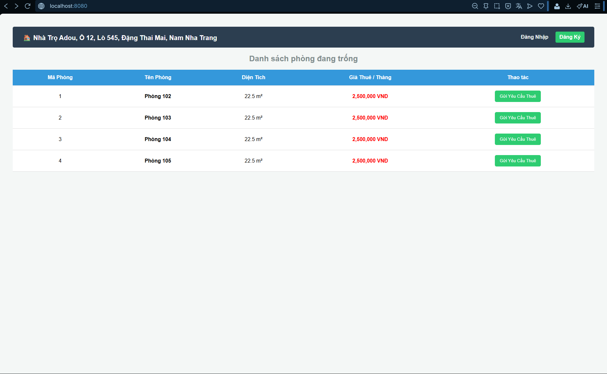

#### 🔹 Hình 5.2: Biểu mẫu đăng ký tài khoản thành viên mới cho khách thuê
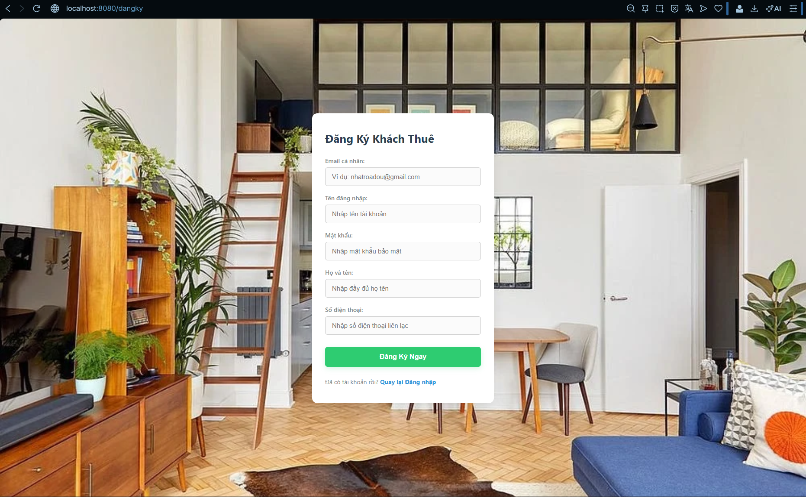

#### 🔹 Hình 5.3: Giao diện biểu mẫu đăng nhập bảo mật của hệ thống
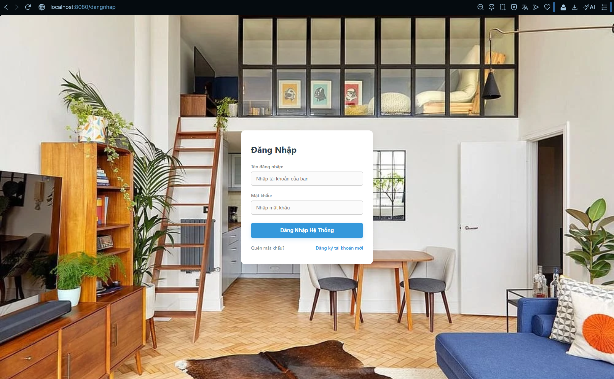


---

### 👤 PHẦN II: KHÔNG GIAN TƯƠNG TÁC CỦA KHÁCH THUÊ (USER)

#### 🔹 Hình 5.4: Giao diện trang chủ khi tài khoản vừa đăng nhập và chưa liên kết phòng trọ
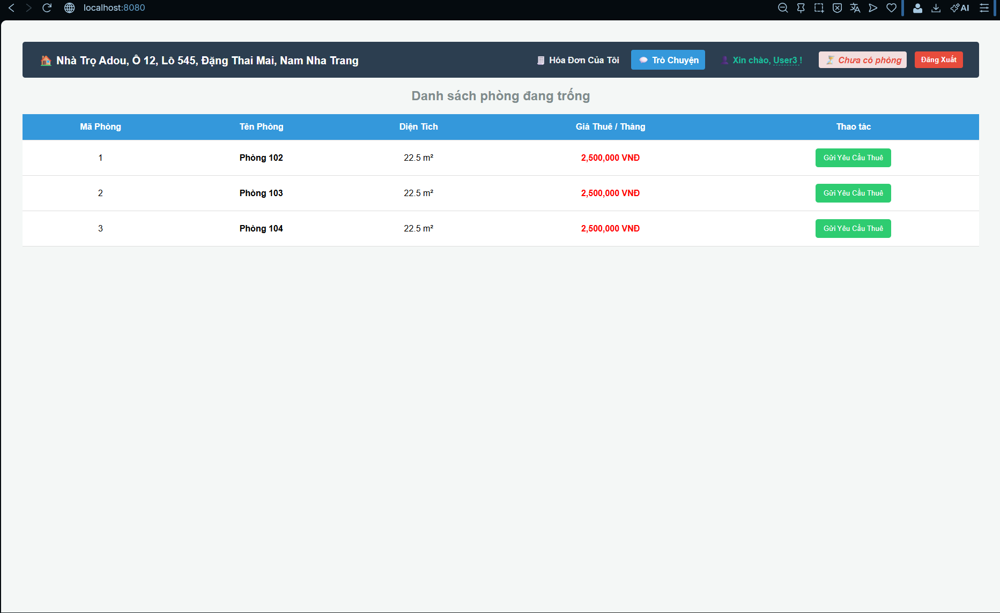

#### 🔹 Hình 5.5: Minh chứng thao tác gửi phiếu yêu cầu thuê căn phòng trọ được chọn
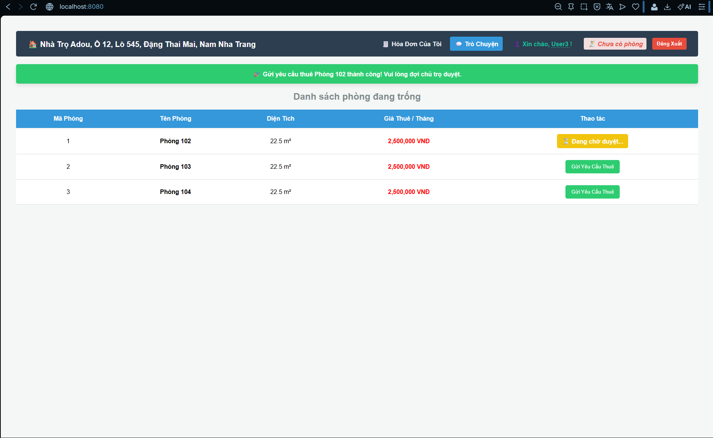

#### 🔹 Hình 5.6: Màn hình trang chủ tự động cập nhật mã phòng sau khi được Admin phê duyệt
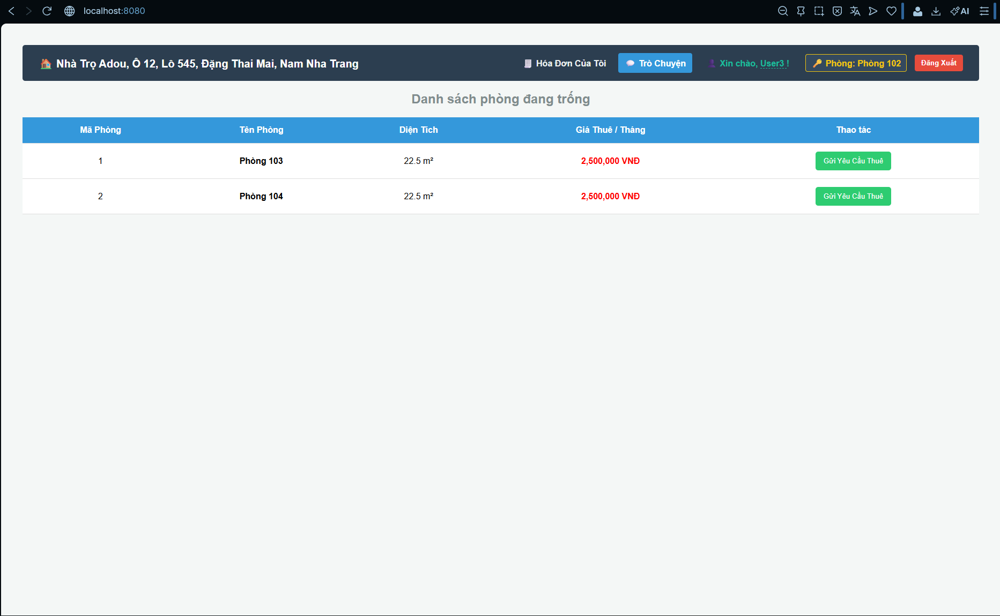

#### 🔹 Hình 5.7: Giao diện trang hoá đơn báo khi chưa có hóa đơn chu kỳ mới
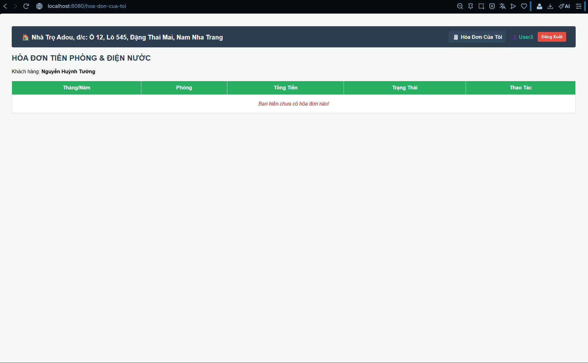

#### 🔹 Hình 5.8: Bảng kê chi tiết hóa đơn tiền phòng và khu vực thanh toán
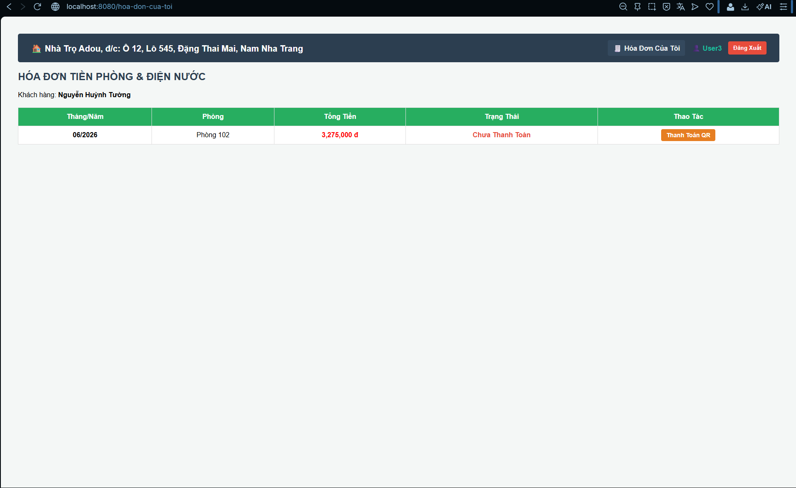

#### 🔹 Hình 5.9: Giao diện hộp thư nội bộ gửi báo cáo sự cố hạ tầng về cho chủ trọ
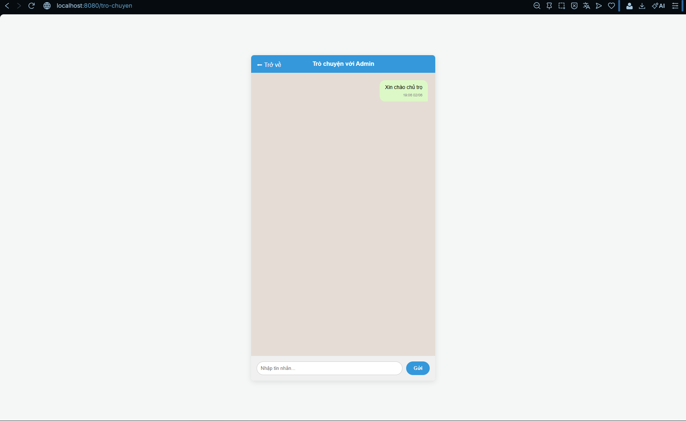

#### 🔹 Hình 5.10: Biểu mẫu cập nhật thông tin hồ sơ cá nhân và đính kèm ảnh chụp CCCD hai mặt
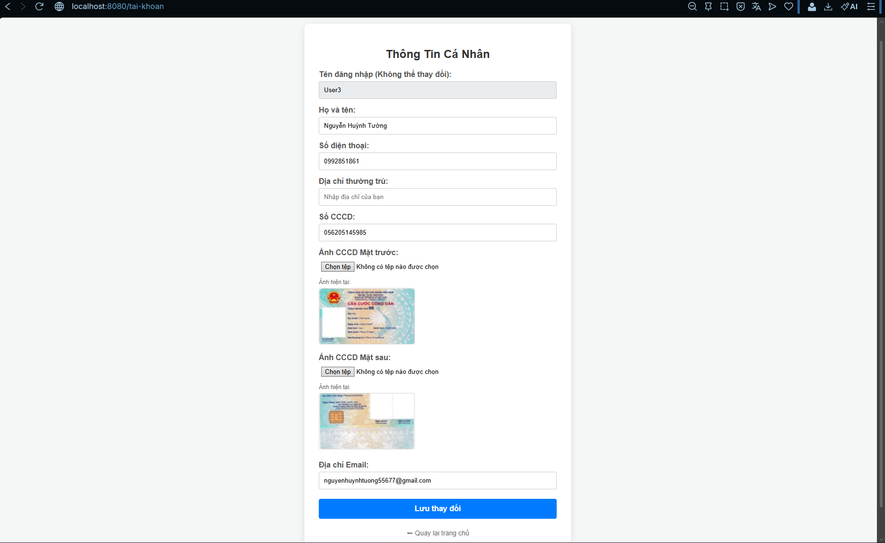

---

### 🛡️ PHẦN III: KHÔNG GIAN QUẢN TRỊ CỦA CHỦ TRỌ (ADMIN)

#### 🔹 Hình 5.11: Bảng điều khiển quản trị tổng quan (Dashboard) của tài khoản Admin
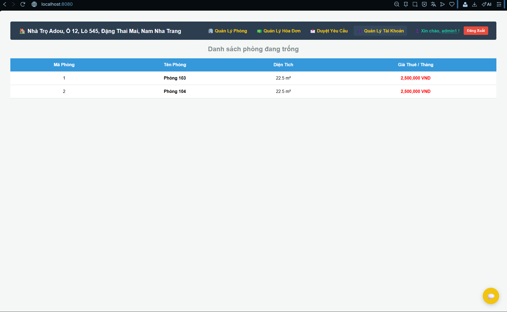

#### 🔹 Hình 5.12: Giao diện danh sách quản lý hạ tầng hệ thống phòng trọ kèm bộ lọc trạng thái
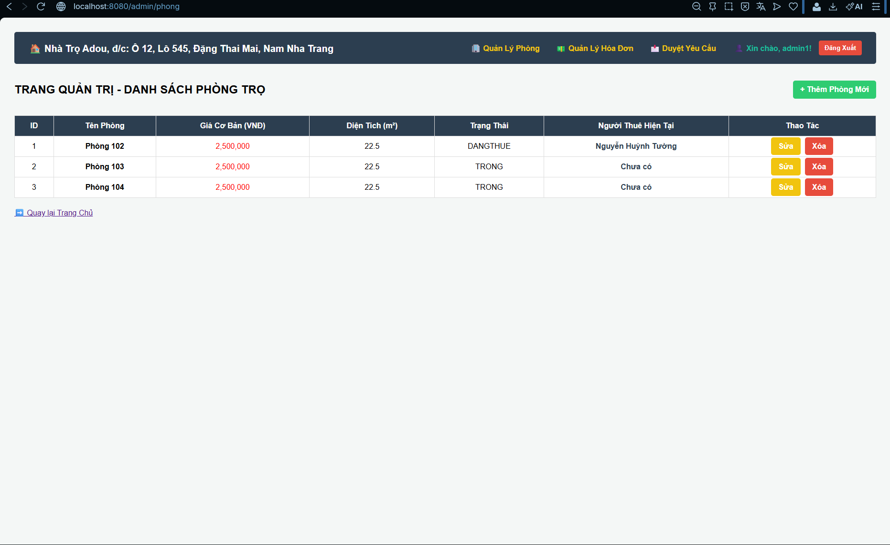

#### 🔹 Hình 5.13: Biểu mẫu thiết lập các thông số kỹ thuật và cấu hình thêm phòng trọ mới
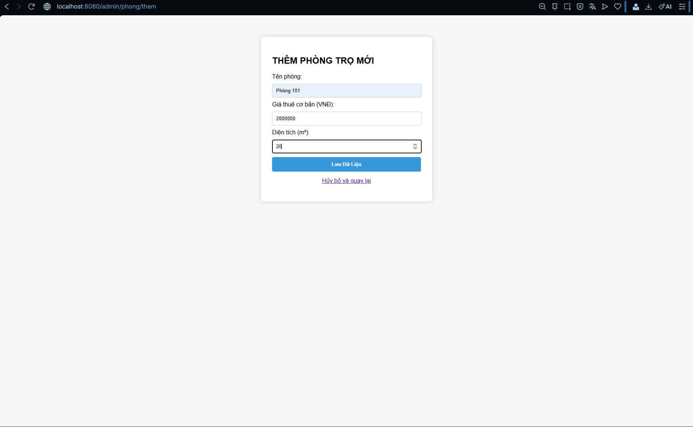

#### 🔹 Hình 5.14: Trung tâm giám sát trạng thái thanh toán của toàn bộ hóa đơn
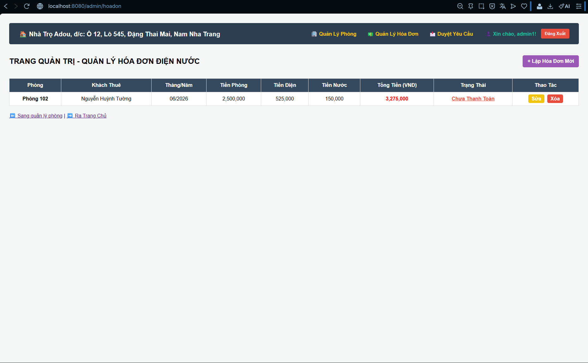

#### 🔹 Hình 5.15: Biểu mẫu khởi tạo hóa đơn tự động tính toán theo chỉ số tiêu thụ điện nước


#### 🔹 Hình 5.16: Danh sách tiếp nhận, xử lý và phê duyệt các yêu cầu thuê phòng trực tuyến từ khách
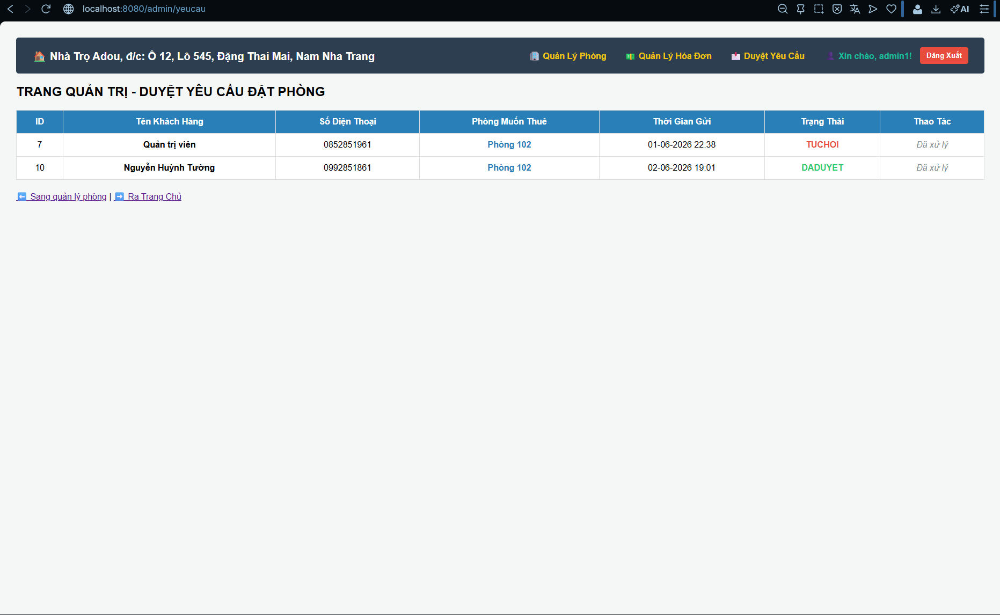

#### 🔹 Hình 5.17: Giao diện quản lý danh sách tài khoản, kiểm tra ảnh CCCD lưu trú và chức năng khóa quyền
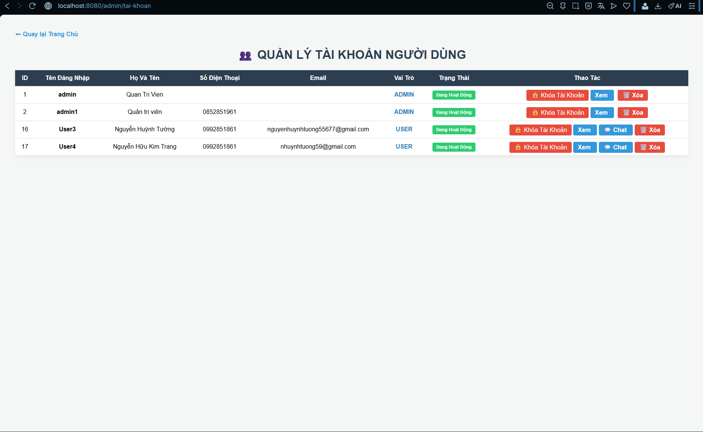

#### 🔹 Hình 5.18: Trung tâm điều phối, tiếp nhận và phản hồi luồng tin nhắn báo lỗi từ khách thuê
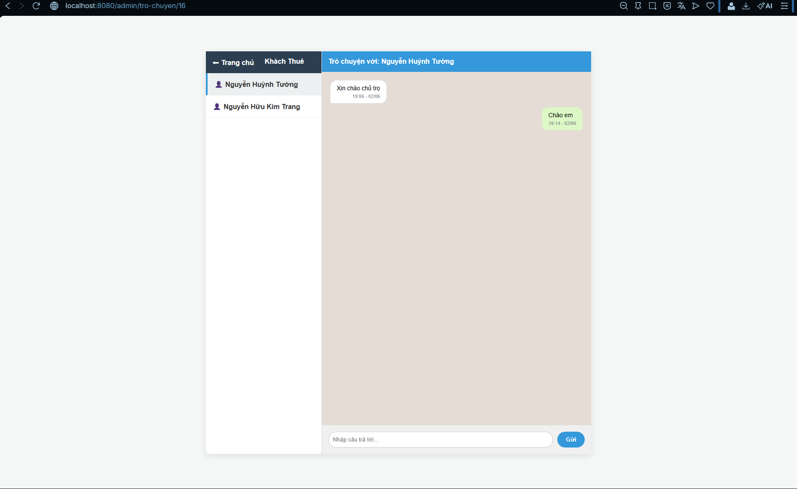

---

## 💾 Thiết Kế Lược Đồ Dữ Liệu (MySQL)

Hệ thống tổ chức lưu trữ thông tin tập trung trên RDBMS MySQL thông qua 5 bảng quan hệ logic đã được chuẩn hóa cấu trúc:
1. `phongtro`: Ghi nhận dữ liệu cốt lõi về tên phòng, giá phòng cố định, diện tích và trạng thái phòng.
2. `nguoidung`: Quản lý định danh tài khoản, mật khẩu băm, thông tin cá nhân và trường khóa ngoại `maphong`.
3. `hoadon`: Lưu trữ lịch sử tính tiền, mốc thời gian, các chỉ số điện nước cũ/mới và chuỗi ảnh minh chứng.
4. `yeucauthue`: Hàng đợi lưu trữ các phiếu đăng ký đặt phòng từ khách thuê gửi lên.
5. `thongbao`: Kênh lưu trữ nội dung tin nhắn chat nội bộ giữa các tài khoản.

---

## ⚙️ Hướng Dẫn Triển Khai Hệ Thống Tại Máy Cục Bộ (Local)

### ⌨️ Chuẩn bị môi trường máy chủ
* Nền tảng Java: JDK 17+.
* Cơ sở dữ liệu: XAMPP Server v3.3+.
* Trình biên dịch: Eclipse IDE hoặc IntelliJ IDEA.

### Bước 1: Đồng bộ hóa cơ sở dữ liệu
1. Khởi động hai dịch vụ **Apache** và **MySQL** bên trong XAMPP Control Panel.
2. Sử dụng trình duyệt truy cập vào hệ quản trị `http://localhost/phpmyadmin/`.
3. Tạo mới một cơ sở dữ liệu trống với tên chính xác là: `quanlyphongtro`.
4. Chọn tab **Import**, tải file script dữ liệu `quanlyphongtro.sql` đính kèm lên hệ thống để tự động thiết lập cấu trúc bảng và nạp dữ liệu demo.

### Bước 2: Thiết lập tham số kết nối cấu hình Spring Boot
Mở mã nguồn dự án trên IDE, tìm đến file cấu hình hệ thống `src/main/resources/application.properties` để điều chỉnh thông số truy cập MySQL của máy cậu:
```properties
spring.datasource.url=jdbc:mysql://localhost:3306/quanlyphongtro?useUnicode=true&characterEncoding=UTF-8
spring.datasource.username=root
spring.datasource.password=
spring.jpa.hibernate.ddl-auto=update
spring.jpa.show-sql=true